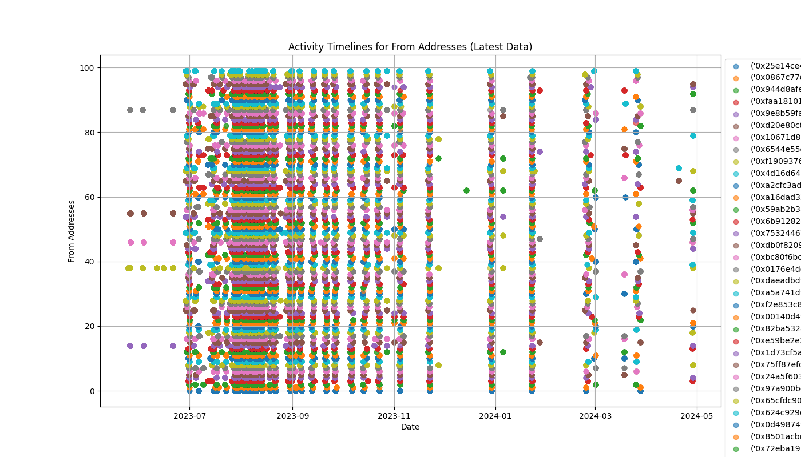
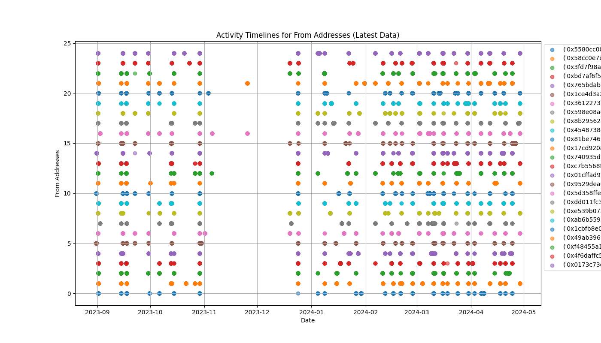

# Introduction
This report contains 13 selected clusters with solid on-chain evidence of sybil behaviors.

# Detailed Methodology & Walkthrough
In this section, we will guide you through our method for identifying potential sybil clusters and provide on-chain sybil evidence for each cluster to strengthen our argument.

## Clustering Stage
This subsection details our approach to clustering potential sybil wallets. First, we extracted all potential wallet addresses from the provided LayerZero snapshot #1, excluding those identified in the repository [sybil-report](https://github.com/LayerZero-Labs/sybil-report). Second, we executed a Dune SQL query to filter out addresses that withdrew and deposited to the same CEX addresses (Binance, Bybit, OKX) within 48 hours. Third, we characterized each wallet address with the following vector: message count, project count, oapps count, active day count, first date, last date, total swapped USD, swap count, and average swapped USD. We then used the k-means algorithm to cluster them.

## Manual Verification Stage
We acknowledged that the clustering process might produce false positives, necessitating a more robust collection of sybil evidence. Due to limited manpower and time constraints, we focused on small clusters with sizes ranging from 20 to 100.

For each cluster presented in this report: first, an intuitive activity timeline is generated to help us decide whether to proceed with further on-chain activity analysis; second, if further on-chain activity analysis is warranted, a manual verification process is conducted to identify any suspected sybil activity. A customized script is then run to collect transactions specific to the type of sybil activity for all addresses in the cluster. Third, addresses without the identified sybil activity are removed from the cluster, leaving only those addresses exhibiting the same suspected sybil activity.

# Explanation of Evidence for Sybil Cluster
In this section, we will present the found evidence for each cluster. All data related to the each cluster is placed under the folder `./clusters/cluster_{NUMBER}`. Inside the folder, the following files are expected:
- cluster_{NUMBER}_address.txt, contains the addresses in this cluster.
- cluster_{NUMBER}_feature_vector.csv, contains the feature vector of the cluster.
- cluster_{NUMBER}_timeline.png, the activity timeline of the cluster.
Other auxiliary files may be provided to confirm the found sybil acitivty in manual verification stage.

## Cluster 1
|address|message_count|project_count|oapps_count|active_day_count|first_date|last_date|total_swapped_usd|swap_count|average_swapped_usd|
|-------|-------------|-------------|-----------|----------------|----------|---------|-----------------|----------|-------------------|
|0xa50c27dbd0ce74cbd5e59be3e57213d161060230|38|10|17|21|2023-04-30|2024-04-27|2370.218400958|11|215.4744000870909|
|0x878a1f6336223912986efd12115cb09000b05f2d|37|11|16|21|2023-04-30|2024-04-28|2605.850571062|12|217.1542142551667|
|0xaf86896ed76d4336623676a4b3c274de9e440b4a|41|11|17|22|2023-04-30|2024-04-28|3011.477913967|14|215.10556528335715|
|0x257ea5624edfd29b9edb401c5241b986b2ec440b|38|11|17|19|2023-04-30|2024-04-27|2402.0641319899996|11|218.36946654454542|
|0xdef8074cfe09d042de346ca92cb8b2fb52f5348d|39|11|18|22|2023-04-30|2024-04-28|2484.689096283|11|225.88082693481817|
|0x2f1044f9994cc141e5aeca56bc4bda9282a08b80|67|11|18|21|2023-04-29|2024-04-27|3885.9670981048002|18|215.88706100582223|
|0xc809456590f3dfafeb1fa9289a986f3d8b754bd1|35|10|18|22|2023-04-30|2024-04-27|2451.9131654280004|12|204.32609711900002|
|0x2c15dec724c251250f5cb3e55cc738946422543f|35|10|16|20|2023-04-30|2024-04-27|2931.6952241860004|12|244.30793534883335|
|0x366ca3f02cbc1eb733c9bffa3c7dbc582e79ae38|40|10|18|23|2023-04-30|2024-04-28|2702.1500075460003|13|207.85769288815388|

For cluster 1, we observed the following similar characteriscs.
```
1. The first layerzero transaction dates are 2023-04-29 or 2023-04-30.
2. The last layerzero transaction dates are 2024-04-26 to 2024-04-28.
3. The average swapped usd of all addressses has a mean of 226.66 with a small deviation.
4. The number of used oapps ranges from 14 to 19.
5. The number of used projects ranges from 9 to 12.
```
Find the complete generated feature vector in [cluster 1 feature vector](./clusters/cluster_1/cluster_1_feature_vector.csv).


From the above activity timeline chart, where each point represents a layerzero transaction and color indicates the belonging address, a pattern is identified that most addresses in this cluster tend to be active on same period of time or even same day. For instance, between 2023-05 and 2023-07, at the beginning of 2024-03 and when close to 2024-05.

After the above two analyses, a high confidence is gained. A further investigation is conducted on Ethereum mainnet and an other obivous sybil pattern is recoganized and described as follows.

|blockNumber|timeStamp|hash|from|to|value|gasPrice|gas|
|-----------|---------|----|----|--|-----|--------|-----|
|17657645|2023-07-09 19:31:11|0x647f61668b5be0be3b2515df593c3e45e9ff29fa354047ef6c9b0f56118d6138|0xa7efae728d2936e78bda97dc267687568dd593f3|0x5bc38fc6266016033d9386f02309a4ec8c351832|45306500000000000|30217386470|210000|
|17661635|2023-07-10 08:57:59|0x672fff5b11ebc28edfc2d4464f06e33fd96e10d3126dde8ddbe9decfc188b869|0x5bc38fc6266016033d9386f02309a4ec8c351832|0xae0ee0a63a2ce6baeeffe56e7714fb4efe48d419|13405723417889680|14776779075|175827|
|17690918|2023-07-14 11:50:11|0xfb90142937c5e973e2ca00a135a8b96054f9c1ceee6aad09bae3463831ed253d|0x5bc38fc6266016033d9386f02309a4ec8c351832|0x32400084c286cf3e17e7b677ea9583e60a000324|28620216596869876|14526685662|149210|
|17691176|2023-07-14 12:42:23|0xa6b2a1f411d20cc64f7486e157573cc035ea4e59e82a633b2a02b84db1c334d0|0x5bc38fc6266016033d9386f02309a4ec8c351832|0xabea9132b05a70803a4e85094fd0e1800777fbef|4389544297000000|15204079284|90000|
|17657929|2023-07-09 20:28:11|0xe53208d3cee87b0d2faee3f20a4aafd64188f34a58194bf252f0928175238092|0xa7efae728d2936e78bda97dc267687568dd593f3|0x8ea166cbde27f83eea7bf9c60517afb108fe1505|48142000000000000|20128786170|210000|
|17661721|2023-07-10 09:15:11|0x1fc239f7e7058a31234f91ad3ffe9be5276f067810c562bbd78e3cf5e55effd4|0x8ea166cbde27f83eea7bf9c60517afb108fe1505|0xae0ee0a63a2ce6baeeffe56e7714fb4efe48d419|13527684504143150|13924214499|175809|
|17703780|2023-07-16 07:28:23|0x03be74cf1046c96ab3e0e1c46c9b17041c69f653f8086f8db41b7eb0116cc92d|0x8ea166cbde27f83eea7bf9c60517afb108fe1505|0x32400084c286cf3e17e7b677ea9583e60a000324|30899105790122934|15320643196|149210|
|17703786|2023-07-16 07:29:35|0x0a9d8421e00a475125dbe02132666a59a14030ecf857d2dce04fe4bc8baf6ae1|0x8ea166cbde27f83eea7bf9c60517afb108fe1505|0xabea9132b05a70803a4e85094fd0e1800777fbef|4409357402000000|13658520719|90000|

The above table shows two addressses received similar amount of ETH [0.0437567,0.0496597] around 8PM 2023-07-09 and then send ETH to [starknet bridge](https://etherscan.io/address/0xae0ee0a63a2ce6baeeffe56e7714fb4efe48d419), [zksync era bridge](https://etherscan.io/address/0x32400084c286cf3e17e7b677ea9583e60a000324) and [zksync lite bridge](https://etherscan.io/address/0xabea9132b05a70803a4e85094fd0e1800777fbef) respectively in order.

Find all downloaded mainnet transactions for all the above addresses in [cluster 1 transaction](./clusters/cluster_1/cluster_1_mainnet_transaction.csv).

You are also free to visit https://etherscan.io for verification.

## Cluster 2

|address|message_count|project_count|oapps_count|active_day_count|first_date|last_date|total_swapped_usd|swap_count|average_swapped_usd|
|-------|-------------|-------------|-----------|----------------|----------|---------|-----------------|----------|-------------------|
|0xb00ddf0f49e0583a8a03ad60a57833759d0fdf32|32|11|17|16|2023-04-30|2024-04-27|2545.287092567|11|231.38973568790908|
|0x1154857e04488cb93b4a5fbd2358e42720e6848e|35|10|17|20|2023-04-30|2024-04-28|2530.172284088|11|230.0156621898182|
|0x5b418531b076504a474ada705449ad5e1e2b18a5|35|11|16|19|2023-04-30|2024-04-27|2580.536443605|10|258.0536443605|
|0xf07153babb00aa76aecf854a23e099d53b41e019|36|10|18|21|2023-04-30|2024-04-26|2967.983005268|12|247.33191710566666|
|0x874637ad214f292f2ec75c972f41fdb28be7f57c|37|10|19|19|2023-04-30|2024-04-29|2930.42798387|12|244.20233198916665|
|0x3423b946499d6a0043020a3b34654ff60432e46a|36|10|16|19|2023-04-30|2024-04-26|2848.481205881|12|237.37343382341666|
|0xafc70687641938eb55056acdb402c045148f9116|39|11|19|19|2023-04-30|2024-04-27|3234.4783675510002|13|248.80602827315386|
|0x4455656921f4e5da8d8f3e734a7a3e56b4b038ac|34|10|18|17|2023-04-30|2024-04-25|2645.4216976949997|12|220.45180814124998|
|0xc319f5afb0482053668a7c39fc0812144e3e2dfa|37|11|17|19|2023-04-30|2024-04-26|3028.4203856460003|12|252.36836547050004|
|0x2db1b7c17f20c2cdaecb8a859f6f5196f55d67d7|35|10|16|19|2023-04-30|2024-04-28|2499.067742058|11|227.18797655072729|
|0x86ab6323974e7af451a8f71ac19374c4253faebf|38|11|18|20|2023-04-30|2024-04-27|2791.619669569|12|232.63497246408335|

For cluster 2, we observed the following similar characteriscs.
```
1. The first layerzero transaction dates are 2023-04-30.
2. The last layerzero transaction dates are 2024-04-26 to 2024-04-28.
3. The average swapped usd of all addressses has a mean of 241.93156.
4. The message count has a mean of 35.51282 with a small deviation of 2.98
```

Find the complete generated feature vector in [cluster 2 feature vector](./clusters/cluster_2/cluster_2_feature_vector.csv).


From the above figure, we can recoganize a pattern that most addresses in this cluster tend to be active on same period of time or even same day. For instance, between 2023-05 and 2023-07, at the beginning of 2024-03 and when close to 2024-05.

After we dive deeper, a strong sybil pattern is observed on their last active day (2024-04-26 to 2024-04-28) that:
1. all addresses receive a similar amount of USDV (from 5000 to 5100) from bitget (0x97b9D2102A9a65A26E1EE82D59e42d1B73B68689) on BNB chain
2. bridge the same amount of USDV to other chains (Arbitrum, Optimism, and Avalanche) through Layerzero
3. bridge the same amount of USDV back to BNB chain
4. send USDV to an independent bitget despoit address, which will then transfer USDV to bitget (0x97b9D2102A9a65A26E1EE82D59e42d1B73B68689)

|source_chain_name|source_hash|source_address|destination_chain_name|destination_hash|destination_address|timestamp|token|value|
|-|-|-|-|-|-|-|-|-|
|"BNB Chain"|"0xfc6ce6d8d3e8d552cb7056e13341cb3d96b876b1de7583eabf51ea550d0ced81"|"0x97b9d2102a9a65a26e1ee82d59e42d1b73b68689"|"BNB Chain"|"0xfc6ce6d8d3e8d552cb7056e13341cb3d96b876b1de7583eabf51ea550d0ced81"|"0xb00ddf0f49e0583a8a03ad60a57833759d0fdf32"|"2024-04-27 05:37:32.000"|"USDV"|"5013.740226"|
|"BNB Chain"|"0x2e6e36dce2e2880545a274ba7b5e9642105826154cd7476b3bd4160bcc894ce9"|"0xb00ddf0f49e0583a8a03ad60a57833759d0fdf32"|"BNB Chain"|"0x2e6e36dce2e2880545a274ba7b5e9642105826154cd7476b3bd4160bcc894ce9"|"0x0000000000000000000000000000000000000000"|"2024-04-27 05:38:56.000"|"USDV"|"5013.740226"|
|"BNB Chain"|"0x2e6e36dce2e2880545a274ba7b5e9642105826154cd7476b3bd4160bcc894ce9"|"0xb00ddf0f49e0583a8a03ad60a57833759d0fdf32"|"Optimism"|"0x491a1602c58732c3d3f5d216b9ab9867fb84d8218b0bd0a05ad107b0e546d812"|"0xb00ddf0f49e0583a8a03ad60a57833759d0fdf32"|"2024-04-27 05:38:56.000"|"USDV"|"5013.740226"|
|"Optimism"|"0x491a1602c58732c3d3f5d216b9ab9867fb84d8218b0bd0a05ad107b0e546d812"|"0x0000000000000000000000000000000000000000"|"Optimism"|"0x491a1602c58732c3d3f5d216b9ab9867fb84d8218b0bd0a05ad107b0e546d812"|"0xb00ddf0f49e0583a8a03ad60a57833759d0fdf32"|"2024-04-27 05:40:07.000"|"USDV"|"5013.740226"|
|"Optimism"|"0x94170312bfcd114dbf82d240882013db40b128d46ef3cce347b2165cb6a050dc"|"0xb00ddf0f49e0583a8a03ad60a57833759d0fdf32"|"BNB Chain"|"0x04baedba111da69af77a233ca805213ec72ca9b9482914e5653180cb8a09cb6a"|"0xb00ddf0f49e0583a8a03ad60a57833759d0fdf32"|"2024-04-27 05:40:45.000"|"USDV"|"5013.740226"|
|"BNB Chain"|"0x94170312bfcd114dbf82d240882013db40b128d46ef3cce347b2165cb6a050dc"|"0xb00ddf0f49e0583a8a03ad60a57833759d0fdf32"|"BNB Chain"|"0x94170312bfcd114dbf82d240882013db40b128d46ef3cce347b2165cb6a050dc"|"0x0000000000000000000000000000000000000000"|"2024-04-27 05:40:45.000"|"USDV"|"5013.740226"|
|"BNB Chain"|"0x04baedba111da69af77a233ca805213ec72ca9b9482914e5653180cb8a09cb6a"|"0x0000000000000000000000000000000000000000"|"BNB Chain"|"0x04baedba111da69af77a233ca805213ec72ca9b9482914e5653180cb8a09cb6a"|"0xb00ddf0f49e0583a8a03ad60a57833759d0fdf32"|"2024-04-27 05:41:38.000"|"USDV"|"5013.740226"|
|"BNB Chain"|"0x63f3aaa87f4105634a19d63584ca02978f125728d40e0a3161ad3b75c128f3be"|"0xb00ddf0f49e0583a8a03ad60a57833759d0fdf32"|"BNB Chain"|"0x63f3aaa87f4105634a19d63584ca02978f125728d40e0a3161ad3b75c128f3be"|"0x13ca41b5de320a86b36a9ce6d2949c2ccb04cadc"|"2024-04-27 05:44:05.000"|"USDV"|"5013.740226"|
|"BNB Chain"|"0x27c02dde7158d0f880109567568f1db5b618b4a12ab608e9604b63acf35c7a38"|"0x13ca41b5de320a86b36a9ce6d2949c2ccb04cadc"|"BNB Chain"|"0x27c02dde7158d0f880109567568f1db5b618b4a12ab608e9604b63acf35c7a38"|"0x97b9d2102a9a65a26e1ee82d59e42d1b73b68689"|"2024-04-27 05:48:35.000"|"USDV"|"5013.740226"|
|"BNB Chain"|"0xe8882562677dbd207c4e71390f3e0002e63db85850ad64bba7ee6dd23271ce57"|"0x97b9d2102a9a65a26e1ee82d59e42d1b73b68689"|"BNB Chain"|"0xe8882562677dbd207c4e71390f3e0002e63db85850ad64bba7ee6dd23271ce57"|"0x1154857e04488cb93b4a5fbd2358e42720e6848e"|"2024-04-28 18:16:34.000"|"USDV"|"5018.882544"|
|"BNB Chain"|"0x8422a1eb107e57f3fbc8454a50761385c8a83d5eb0e166e63807730b5afbb4ff"|"0x1154857e04488cb93b4a5fbd2358e42720e6848e"|"BNB Chain"|"0x8422a1eb107e57f3fbc8454a50761385c8a83d5eb0e166e63807730b5afbb4ff"|"0x0000000000000000000000000000000000000000"|"2024-04-28 18:17:46.000"|"USDV"|"5018.882544"|
|"BNB Chain"|"0x8422a1eb107e57f3fbc8454a50761385c8a83d5eb0e166e63807730b5afbb4ff"|"0x1154857e04488cb93b4a5fbd2358e42720e6848e"|"Avalanche"|"0x3092e7cf379d6c37c94821a119d0a59c7650ba1d2d7a960f35fc02d0083c258a"|"0x1154857e04488cb93b4a5fbd2358e42720e6848e"|"2024-04-28 18:17:46.000"|"USDV"|"5018.882549"|
|"Avalanche"|"0x3092e7cf379d6c37c94821a119d0a59c7650ba1d2d7a960f35fc02d0083c258a"|"0x0000000000000000000000000000000000000000"|"Avalanche"|"0x3092e7cf379d6c37c94821a119d0a59c7650ba1d2d7a960f35fc02d0083c258a"|"0x1154857E04488Cb93b4A5fBd2358e42720e6848E"|"2024-04-28 16:19:05.000"|"USDV"|"5018.882544"|
|"Avalanche"|"0x993a82fc6816e2071988610842bb8a4b7011f5e97edf17a74d7af7e443e49159"|"0x1154857e04488cb93b4a5fbd2358e42720e6848e"|"BNB Chain"|"0x290e0263128a523c7e766f564eeff09df4cc21fe80a467301728e25462110bbd"|"0x1154857e04488cb93b4a5fbd2358e42720e6848e"|"2024-04-28 18:19:45.000"|"USDV"|"5018.882549"|
|"BNB Chain"|"0x993a82fc6816e2071988610842bb8a4b7011f5e97edf17a74d7af7e443e49159"|"0x1154857E04488Cb93b4A5fBd2358e42720e6848E"|"BNB Chain"|"0x993a82fc6816e2071988610842bb8a4b7011f5e97edf17a74d7af7e443e49159"|"0x0000000000000000000000000000000000000000"|"2024-04-28 16:19:45.000"|"USDV"|"5018.882544"|
|"BNB Chain"|"0x290e0263128a523c7e766f564eeff09df4cc21fe80a467301728e25462110bbd"|"0x0000000000000000000000000000000000000000"|"BNB Chain"|"0x290e0263128a523c7e766f564eeff09df4cc21fe80a467301728e25462110bbd"|"0x1154857e04488cb93b4a5fbd2358e42720e6848e"|"2024-04-28 18:20:19.000"|"USDV"|"5018.882544"|
|"BNB Chain"|"0xdbc6845daf5a95e0af6cf8c29c146afd7cee05f828324bf9d50d57023c8b2ffd"|"0x1154857e04488cb93b4a5fbd2358e42720e6848e"|"BNB Chain"|"0xdbc6845daf5a95e0af6cf8c29c146afd7cee05f828324bf9d50d57023c8b2ffd"|"0xb7f2adc27f8bdfbe271ae1dc72341150e0733d41"|"2024-04-28 18:24:40.000"|"USDV"|"5018.882544"|
|"BNB Chain"|"0x8b4fb0722502e3102c0320065b74db8894a4650f8dbe76fa3af0adc5d1e3d86a"|"0xb7f2adc27f8bdfbe271ae1dc72341150e0733d41"|"BNB Chain"|"0x8b4fb0722502e3102c0320065b74db8894a4650f8dbe76fa3af0adc5d1e3d86a"|"0x97b9d2102a9a65a26e1ee82d59e42d1b73b68689"|"2024-04-28 18:27:34.000"|"USDV"|"5018.882544"|

The table above shows the complete circle on 0xb00ddf0f49e0583a8a03ad60a57833759d0fdf32 and 0x1154857e04488cb93b4a5fbd2358e42720e6848e.
Below we only explain how it works on 0xb00ddf0f49e0583a8a03ad60a57833759d0fdf32:
1. 0xb00ddf0f49e0583a8a03ad60a57833759d0fdf32 withdraw 5013.740226 from Bitget 0x97b9d2102a9a65a26e1ee82d59e42d1b73b68689 on BNB chain
2. 0xb00ddf0f49e0583a8a03ad60a57833759d0fdf32 transfer 5013.740226 from BNB chain to Optimism
3. 0xb00ddf0f49e0583a8a03ad60a57833759d0fdf32 transfer 5013.740226 from Optimism to BNB chain
4. 0xb00ddf0f49e0583a8a03ad60a57833759d0fdf32 transfer 5013.740226 to 0x13ca41b5de320a86b36a9ce6d2949c2ccb04cadc (independent Bitget deposit address)
5. 0x13ca41b5de320a86b36a9ce6d2949c2ccb04cadc transfer 5013.740226 back to Bitget 0x97b9d2102a9a65a26e1ee82d59e42d1b73b68689

The exactly same circle can be found for 0x1154857e04488cb93b4a5fbd2358e42720e6848e and all other addresses in the list.

Find all downloaded usdv events for all the above addresses in [cluster 2 usdv events](./clusters/cluster_2/cluster_2_usdv_events.csv).

## Cluster 3
|address|message_count|project_count|oaps_count|active_day_count|first_date|last_date|total_swapped_usd|swap_count|average_swapped_usd|
|---|---|---|---|---|---|---|---|---|---|
|0x4cb9199df22d3084270aaa73f7674cb7f20af586|79|6|15|40|2023-07-19|2024-04-14|12796.012749682995|67|190.98526492064173|
|0x128b664ecd39ede0cb446ab754b761a70ce07bd0|76|6|14|42|2023-07-21|2024-04-09|12438.822581677003|63|197.44162828058734|
|0x17090f11498f205a7d376965f7a1010f255ca68b|73|6|16|40|2023-07-21|2024-04-08|12376.677229900999|60|206.2779538316833|
|0xc64770f92b5b6e27e44e5175c91839b758a10ade|79|6|15|39|2023-07-19|2024-04-14|12915.453643210001|66|195.6886915637879|
|0x217ce7c40b30284ed664033733102b80a0eb0346|80|6|14|40|2023-07-19|2024-04-14|12856.251848821998|68|189.0625271885588|
|0xf8dbe0a81060de854ebb88a19fa8e1b467d24477|77|5|15|41|2023-07-21|2024-04-10|12821.643658990997|64|200.33818217173433|
|0xbd16aad720e3ad6db7e9ecc3cfbf27b9f2bfe866|78|6|15|42|2023-07-21|2024-04-09|12596.486953014004|66|190.8558629244546|
|0xd12253cf9bb7c1b11f811186ede3bae79c82ae89|78|6|15|40|2023-07-19|2024-04-14|12767.781308627002|66|193.45123194889396|
|0x1383e8c8afa8c47101c31dcd6f46bf2486515be3|80|5|14|40|2023-07-21|2024-04-15|12800.996508783996|68|188.24994865858818|
|0xd6180b8f549499ad433a278bcd87eb8c55fce9a8|79|5|13|40|2023-07-19|2024-04-15|13031.700840341002|68|191.64265941677945|
|0xe1136f97919ee8183ae4986a99e7780fb697ff8c|79|5|13|40|2023-07-19|2024-04-15|12865.281302690997|68|189.1953132748676|
|0x07a596e9c8dff114954286b19ae9a9530168c124|77|6|15|41|2023-07-21|2024-04-11|12747.089436722|64|199.17327244878126|
|0x0ecc615137b06ecf8b16efa2910814a6d7f22470|76|6|15|41|2023-07-21|2024-04-08|12416.602192202996|63|197.08892368576184|
|0x6e5cdfa905934aff2d7c19b331a5e3914dfd2a55|75|6|14|38|2023-07-18|2024-04-16|12948.490066832|63|205.53158836241272|
|0x104aad889ae3c971b573c1f54894e7e5fb17b84c|80|6|15|39|2023-07-19|2024-04-16|12950.431472682|67|193.29002198032836|
|0xb663d56ecee040977c7a387e82fc3edf8387027b|77|6|14|41|2023-07-21|2024-04-11|12617.086055079999|64|197.14196961062498|
|0xab803508a6d24341752c58f321ac685818e10151|81|5|14|40|2023-07-19|2024-04-16|12942.907736466004|68|190.33687847744125|
|0x30b5f68e889331efcd7f97a60bd8776522bcbd47|80|6|14|40|2023-07-19|2024-04-16|12782.829365650005|68|187.98278478897066|
|0x4b47845784fdcd35874f4e4cd955a620bdf18ae2|78|5|14|42|2023-07-21|2024-04-10|12742.377591350005|66|193.06632714166673|
|0x4e246073b6d4bdaf362526b1ff6f1d80137f59fa|77|6|15|41|2023-07-21|2024-04-11|12719.603225870997|64|198.74380040423432|

This particular cluster exhibit very high *sybil characteristics*:

```
1. The first layerzero transaction dates are 2023-07-19 and 2-23-07-21.
2. The total swapped usd has a mean of 12756.72629 with a relative small deviation 180.
3. The average swapped usd of all addressses has a mean of 194.777241 with a small deviation 5.2.
4. The message count has a mean of 77.95 with a small deviation of 1.9.
```

Find the complete generated feature vector in [cluster 3 feature vector](./clusters/cluster_3/cluster_3_feature_vector.csv).


From the above figure, we can easily recoganize several patterns:
1. most addresses tend to be active togather.
2. from 2023-08 to 2023-10, they are intensively active.
3. after 2023-11, those addresses keep monthly active.

After we dive deeper, a strong sybil pattern is observed that: on the active day, all addresses receive an amount of usdt from either bitget or binance on BNB chain or polygon, then they swaped all the received usdt through stargate to other chains (Avalanche, polygon, binance), and then transfer those usdt back to a CEX deposit address.

|source_chain_name|source_hash|source_address|destination_chain_name|destination_hash|destination_address|timestamp|token|value|
|-|-|-|-|-|-|-|-|-|
|"BNB Chain"|"0x2efdbd85739c445159ef11a6acf6ecc149a584e6072f9d07934a6e4744b9e428"|"0xa180fe01b906a1be37be6c534a3300785b20d947"|"BNB Chain"|"0x2efdbd85739c445159ef11a6acf6ecc149a584e6072f9d07934a6e4744b9e428"|"0x128b664ecd39ede0cb446ab754b761a70ce07bd0"|"2024-04-09 11:06:03.000"|"USDT"|"145.67"|
|"BNB Chain"|"0xb53bbe7043286a00d90ab52910843ea18c19a21691e0818ef3f4727988d7182c"|"0x128b664ecd39ede0cb446ab754b761a70ce07bd0"|"BNB Chain"|"0xb53bbe7043286a00d90ab52910843ea18c19a21691e0818ef3f4727988d7182c"|"0x9aa83081aa06af7208dcc7a4cb72c94d057d2cda"|"2024-04-09 11:08:06.000"|"USDT"|"145.67"|
|"BNB Chain"|"0xb53bbe7043286a00d90ab52910843ea18c19a21691e0818ef3f4727988d7182c"|"0x128b664ecd39ede0cb446ab754b761a70ce07bd0"|"Polygon"|"0xd17dd1f52ee4bfc8d5b39744e6873da40465abfb2aa0e7bc3b50c8e0ebf6af21"|"0x128b664ecd39ede0cb446ab754b761a70ce07bd0"|"2024-04-09 11:08:06.000"|"USDT"|"145.67"|
|"Polygon"|"0xd17dd1f52ee4bfc8d5b39744e6873da40465abfb2aa0e7bc3b50c8e0ebf6af21"|"0x29e38769f23701a2e4a8ef0492e19da4604be62c"|"Polygon"|"0xd17dd1f52ee4bfc8d5b39744e6873da40465abfb2aa0e7bc3b50c8e0ebf6af21"|"0x128b664ecd39ede0cb446ab754b761a70ce07bd0"|"2024-04-09 11:09:29.000"|"USDT"|"145.487585"|
|"Polygon"|"0x215e98e74fa58b4f02e418f99e4c567eb91eb808bda6470be8838d7de80554ed"|"0x128b664ecd39ede0cb446ab754b761a70ce07bd0"|"Polygon"|"0x215e98e74fa58b4f02e418f99e4c567eb91eb808bda6470be8838d7de80554ed"|"0x81028c4a409420bd64060c92b900d447eeb646a1"|"2024-04-09 11:26:49.000"|"USDT"|"145.487585"|
|"BNB Chain"|"0x4f44ad3e01d2fe3adeed598e099345ff2384e3bc58c39eaf1fc9db1e280e4e90"|"0x515b72ed8a97f42c568d6a143232775018f133c8"|"BNB Chain"|"0x4f44ad3e01d2fe3adeed598e099345ff2384e3bc58c39eaf1fc9db1e280e4e90"|"0x4e246073b6d4bdaf362526b1ff6f1d80137f59fa"|"2024-04-11 04:38:52.000"|"USDT"|"187.67"|
|"BNB Chain"|"0x66ea051690ef54a95a85df4fa6ec9dd2344c5870e015085a5b578928622cb972"|"0x4e246073b6d4bdaf362526b1ff6f1d80137f59fa"|"BNB Chain"|"0x66ea051690ef54a95a85df4fa6ec9dd2344c5870e015085a5b578928622cb972"|"0x9aa83081aa06af7208dcc7a4cb72c94d057d2cda"|"2024-04-11 04:42:25.000"|"USDT"|"187.67"|
|"BNB Chain"|"0x66ea051690ef54a95a85df4fa6ec9dd2344c5870e015085a5b578928622cb972"|"0x4e246073b6d4bdaf362526b1ff6f1d80137f59fa"|"Polygon"|"0x7b5cba54eba978547e983ed95816bdd5091f4354f0af0073bdd4c8dc428df42e"|"0x4e246073b6d4bdaf362526b1ff6f1d80137f59fa"|"2024-04-11 04:42:25.000"|"USDT"|"187.67"|
|"Polygon"|"0x7b5cba54eba978547e983ed95816bdd5091f4354f0af0073bdd4c8dc428df42e"|"0x29e38769f23701a2e4a8ef0492e19da4604be62c"|"Polygon"|"0x7b5cba54eba978547e983ed95816bdd5091f4354f0af0073bdd4c8dc428df42e"|"0x4e246073b6d4bdaf362526b1ff6f1d80137f59fa"|"2024-04-11 04:43:47.000"|"USDT"|"187.453917"|
|"Polygon"|"0xdb5569b4465f9cdeabe4611b0e5816c2e19a94c0a3ec1efa2394fe9742819c46"|"0x4e246073b6d4bdaf362526b1ff6f1d80137f59fa"|"Polygon"|"0xdb5569b4465f9cdeabe4611b0e5816c2e19a94c0a3ec1efa2394fe9742819c46"|"0xa23e16842adbd3f4e806b2eff44b184ff71a50eb"|"2024-04-11 05:09:21.000"|"USDT"|"187.453917"|

The table above shows the complete circle on 0xa180fe01b906a1be37be6c534a3300785b20d947 and 0x4e246073b6d4bdaf362526b1ff6f1d80137f59fa.
Below we only explain how it works on 0xa180fe01b906a1be37be6c534a3300785b20d947:
1. 0xa180fe01b906a1be37be6c534a3300785b20d947 withdraw 145.67 from Binance 0xa180fe01b906a1be37be6c534a3300785b20d947 on BNB chain
2. 0xa180fe01b906a1be37be6c534a3300785b20d947 transfer 145.67 from BNB chain to Polygon
3. 0xa180fe01b906a1be37be6c534a3300785b20d947 transfer 145.67 to 0x81028c4a409420bd64060c92b900d447eeb646a1 (independent Bitget deposit address)

The exactly same circle can be found for 0x4e246073b6d4bdaf362526b1ff6f1d80137f59fa and all other addresses in the list.

Find all downloaded usdt events for all the above addresses in [cluster 3 usdt events](./clusters/cluster_3/cluster_3_usdt_events.csv).

You are also free to visit https://debank.com/ for verification.

## Cluster 4
|address|message_count|project_count|oaps_count|active_day_count|first_date|last_date|total_swapped_usd|swap_count|average_swapped_usd|
|---|---|---|---|---|---|---|---|---|---|
|0x1de063db6f0699f6c9713bd2e91f4cf33ff918bc|106|8|24|37|2023-06-28|2024-04-28|12315.951705586518|25|492.6380682234607|
|0x683f4b066406b05e29e21becbc3f57c268bfda05|108|8|25|36|2023-06-28|2024-04-20|32629.41946844319|34|959.688807895388|
|0x436737efec5dd164770e534f90870160e43d1bac|107|8|22|38|2023-06-28|2024-04-28|37781.98224187716|30|1259.3994080625719|
|0x65cfdc9039381b9cb339dea735a255f95a97ef8a|106|8|24|36|2023-06-28|2024-03-25|29103.712980426568|39|746.2490507801684|
|0xce4c37ba6648d149178e627d98f78b82fe83f419|99|8|23|39|2023-06-28|2024-03-25|40159.24969338235|39|1029.724351112368|
|0xe93400e49428bd23a25441ac410601929abf2513|112|8|24|38|2023-06-28|2024-04-28|16518.523685469823|36|458.84788015193953|
|0xb37646f10e699467a57f8d74ff97404cb176cc77|101|8|24|34|2023-06-28|2024-03-25|45237.0474479096|36|1256.5846513308222|
|0x75ff87efd353277b215eb7d658ceb211b3db07cb|106|8|23|35|2023-06-28|2024-04-28|39664.389898361114|37|1072.0105377935436|
|0x59ab2b380330bc50399109a5964e99703199cb80|102|8|22|35|2023-06-29|2024-03-18|44983.99011194435|36|1249.555280887343|
|0x24a5f603a6fd0871f6d422fb8a384f418ab74f08|103|7|21|33|2023-06-29|2024-03-26|35166.50669577059|33|1065.6517180536543|
|0xbe83c818806c2bba098fa911a55e922ea08f87cb|95|8|23|31|2023-06-29|2024-03-26|64794.213286351725|31|2090.135912462959|

80% of addreses has their first layerzero transaction on 2023-06-30 and rest spread around 2023-06-28-2023-07-01 and the average swapped usd is 1263 across all addresses.

Find the complete generated feature vector in [cluster 4 feature vector](./clusters/cluster_4/cluster_4_feature_vector.csv).



From the above figure, we can easily recoganize several patterns:
1. almost all addresses tend to be active togather on same, for instance, on 2024-01, 2024-03.
2. from 2023-08 to 2023-11, we observed intensive small value (< 5$) of USDT transactions cross different chains (see table below).
3. after 2023-11, those addresses keep being active on the monly base.

|source_chain_name|source_hash|source_address|destination_chain_name|destination_hash|destination_address|timestamp|token|value|
|-|-|-|-|-|-|-|-|-|
|"BNB Chain"|"0x6d88c3002afd5c639d9996fac0dec0e7dce3f897b2640f043724ebcca4566ccc"|"0x1111111254eeb25477b68fb85ed929f73a960582"|"BNB Chain"|"0x6d88c3002afd5c639d9996fac0dec0e7dce3f897b2640f043724ebcca4566ccc"|"0x1de063db6f0699f6c9713bd2e91f4cf33ff918bc"|"2023-07-24 12:03:37.000"|"USDT"|"1.6633960857902803"|
|"BNB Chain"|"0x004909bde569f104f6e6717f361bd850260f6cc4be8a40f42114f58d756c255e"|"0x1de063db6f0699f6c9713bd2e91f4cf33ff918bc"|"BNB Chain"|"0x004909bde569f104f6e6717f361bd850260f6cc4be8a40f42114f58d756c255e"|"0xe9f183fc656656f1f17af1f2b0df79b8ff9ad8ed"|"2023-07-24 12:05:04.000"|"USDT"|"1.6633960857902803"|
|"BNB Chain"|"0xd4d6e0841ee7958ff04957464c4d1b8d30dfb9d64ba14bc30a33876dfeb775bf"|"0x1111111254eeb25477b68fb85ed929f73a960582"|"BNB Chain"|"0xd4d6e0841ee7958ff04957464c4d1b8d30dfb9d64ba14bc30a33876dfeb775bf"|"0x1de063db6f0699f6c9713bd2e91f4cf33ff918bc"|"2023-07-24 12:12:44.000"|"USDT"|"1.1255676784561057"|
|"BNB Chain"|"0x523229ee752ecca28e58e633ccff7c73bf978347a9b613bbf28c1dfdbed38be4"|"0x1de063db6f0699f6c9713bd2e91f4cf33ff918bc"|"BNB Chain"|"0x523229ee752ecca28e58e633ccff7c73bf978347a9b613bbf28c1dfdbed38be4"|"0xe9f183fc656656f1f17af1f2b0df79b8ff9ad8ed"|"2023-07-24 12:14:35.000"|"USDT"|"1.1255676784561057"|
|"BNB Chain"|"0xdee9d3cd7e76d360c41a283d226f2a46acaf79fe55d7297a9a843647cf27f5df"|"0x0000000000000000000000000000000000000000"|"BNB Chain"|"0xdee9d3cd7e76d360c41a283d226f2a46acaf79fe55d7297a9a843647cf27f5df"|"0x1de063db6f0699f6c9713bd2e91f4cf33ff918bc"|"2023-07-27 23:23:20.000"|"USDT"|"1.2"|
|"BNB Chain"|"0x21644ba6dd082f8d53b9164f38ce2efa76379620d7c0c35b3f08e555313dd959"|"0x1de063db6f0699f6c9713bd2e91f4cf33ff918bc"|"BNB Chain"|"0x21644ba6dd082f8d53b9164f38ce2efa76379620d7c0c35b3f08e555313dd959"|"0xe9f183fc656656f1f17af1f2b0df79b8ff9ad8ed"|"2023-07-27 23:25:14.000"|"USDT"|"1.2"|
|"BNB Chain"|"0x65716189a6a58a675cb1c353fc1aac1de298bf408f472900a5411f75ea1d673e"|"0x0000000000000000000000000000000000000000"|"BNB Chain"|"0x65716189a6a58a675cb1c353fc1aac1de298bf408f472900a5411f75ea1d673e"|"0x1de063db6f0699f6c9713bd2e91f4cf33ff918bc"|"2023-08-09 15:25:20.000"|"USDT"|"2.788963764246386"|
|"BNB Chain"|"0x320010f9b73f95127e1ab999e907335ce5e17bac032e77a814cfabf1c3ecd0aa"|"0x1de063db6f0699f6c9713bd2e91f4cf33ff918bc"|"BNB Chain"|"0x320010f9b73f95127e1ab999e907335ce5e17bac032e77a814cfabf1c3ecd0aa"|"0xe9f183fc656656f1f17af1f2b0df79b8ff9ad8ed"|"2023-08-10 14:55:03.000"|"USDT"|"2.788963764246386"|

We downloaded all USDT transactions involving the listed addresses from BNB chain, polygon, arbitrum, and avalache, and find out that all transactions value is below $5, which implies a wash trading of small value. Therefore, we believe they are sybil addresses.

Find all downloaded usdt events for all the above addresses in [cluster 4 wash trading transaction](./clusters/cluster_4/cluster_4_usdt_events.csv).

You are also free to visit https://debank.com/ for verification.

## Cluster 5

|address|message_count|project_count|oaps_count|active_day_count|first_date|last_date|total_swapped_usd|swap_count|average_swapped_usd|
|-|-|-|-|-|-|-|-|-|-|
|0x4f6daffc546b1460d3359d5c008147ac5f988a59|48|15|30|24|2023-09-01|2024-04-24|6420.408657143998|9|713.3787396826665|
|0x3fd7f98a19e0342590309cc2b0594e85693c50e0|55|16|34|25|2023-09-01|2024-04-22|17344.623669305|17|1020.271980547353|
|0x8b2956248bf68502b8a54dc01e573c16096b94d6|56|15|31|24|2023-09-01|2024-04-28|17792.357513060997|18|988.4643062811665|
|0x0173c73ca623c808b68e9b98cbdaf2f2a6ca23c8|45|15|29|24|2023-09-01|2024-04-28|7774.799620256999|10|777.4799620256999|
|0x9529dea686419a6b1f07f3d4541c33a29b49ccde|63|16|35|27|2023-09-01|2024-04-26|16459.589212923|18|914.4216229401668|
|0xf48455a123c09c59db5c5d2f65591b6f1ae9443f|49|16|30|24|2023-09-01|2024-04-24|15681.596536628997|14|1120.1140383306426|
|0xbd7af6f5365174fafc3297d87953617d27ddbbe9|53|14|31|25|2023-09-01|2024-04-24|17150.138928258|15|1143.3425952172|
|0xdd011fc335ce03eb7f7539c4782ed6b93a311f1e|64|14|35|26|2023-09-01|2024-04-28|18276.57190789841|21|870.3129479951624|
|0x5580cc0016fc3dfc20ed7a0345ae6624e3e702e6|53|14|31|27|2023-09-01|2024-04-24|17176.499768530997|15|1145.0999845687331|
|0xab6b55910beb7eb9d7d4d57d19598a9d42b83323|53|15|29|27|2023-09-01|2024-04-28|18184.537123582002|15|1212.3024749054669|
|0x598e08aef0972faabef9a1416eff43077ffad487|49|15|33|25|2023-09-02|2024-04-24|10037.495414607001|10|1003.7495414607001|
|0x1ce4d3a2905ffde06aad86536e9b0ff548bfcd9a|48|15|32|25|2023-08-31|2024-04-24|6818.239094323|10|681.8239094323001|
|0x5d358ffef089a0e51253d5a736f4d063b0fed236|60|17|36|28|2023-09-02|2024-04-28|20579.743090286007|21|979.9877662040956|
|0x3612273192c4f98c28bf574ad6006657c9a6d5e8|47|15|31|25|2023-09-01|2024-04-28|6818.556500043|9|757.6173888936667|
|0xc7b5568f3179bf99671049315b2d5f81398280bc|75|16|37|24|2023-09-01|2024-04-28|15438.442347618|28|551.3729409863571|
|0x58cc0e7e4273cecf4aa8a748bb6277a209322d41|49|16|35|28|2023-09-01|2024-04-28|12813.235780138|12|1067.7696483448333|
|0x81be746978ffab18c97e4fd361f035a794f847e6|51|16|34|24|2023-08-31|2024-04-24|10337.975831565|11|939.8159846877272|
|0x1cbfb8e00d7802ee8e7d52da3f0a20f1971dc802|59|16|33|26|2023-09-01|2024-04-28|21308.983144656|21|1014.713483078857|
|0x45487384181405ba3670eee161bb1a77c44d0807|46|16|32|24|2023-09-01|2024-04-24|5099.278441846999|8|637.4098052308749|
|0x740935d1d2815f6fdc3a700e26333aa430a2153e|61|16|38|26|2023-09-01|2024-04-24|15818.051953935|20|790.90259769675|
|0xe539b07313d8c56c7b1328b8e95fd34cdf9ab0c2|45|14|32|25|2023-09-01|2024-04-28|5607.658788291001|8|700.9573485363751|
|0x17cd920a1c5fc79400c207f3cd0a479bb2123d5f|57|16|30|21|2023-09-01|2024-04-28|16311.530019541002|19|858.5015799758422|
|0x765bdabd4cbf408ffe41fbf41962b2017edc0557|62|17|35|27|2023-09-01|2024-04-24|18398.674257688002|20|919.9337128844002|
|0x49ab3967f4694289474077c977943d83ca157809|54|15|28|27|2023-09-01|2024-04-24|17742.579616037998|16|1108.9112260023749|
|0x01cffad9fb7f3d90b469e3c17e44a7f131fea0e8|67|16|34|24|2023-08-31|2024-04-24|17358.8737322185|20|867.943686610925|

All addreses has their first layerzero transaction on 2023-08-31, 2023-09-01, and 2023-09-02, and last transaction on 2024-04-24, 2024-04-28.

Find the complete generated feature vector in [cluster 5 feature vector](./clusters/cluster_5/cluster_5_feature_vector.csv).



From the above figure, we notice that the very aligned activity date between 2023-09 to 2023-11 and inactive period from 2023-11 to 2024-01. However, still we think the evidence is weak. With a further investigation on the on-chain activity. An interesting behavior is observed:

It all starts with a withdrawal transaction from CEX between 1000 to 1200 USDT, then it will be swapped through stargate to multiple different chains including arbitrum, optimism, bnb chain, polygon, and avalanche in different order (all transactions happens in 48 hours), and eventually it was sent to a CEX deposit address.

|source_chain_name|source_hash|source_address|destination_chain_name|destination_hash|destination_address|timestamp|token|value|
|-|-|-|-|-|-|-|-|-|
|"Arbitrum"|"0x0d12597d769f5fe405f5e1622e5b94d014c253fdef06495109dd3fa0b6d04d8b"|"0x1ab4973a48dc892cd9971ece8e01dcc7688f8f23"|"Arbitrum"|"0x0d12597d769f5fe405f5e1622e5b94d014c253fdef06495109dd3fa0b6d04d8b"|"0x5d358ffef089a0e51253d5a736f4d063b0fed236"|"2024-03-03 13:01:22.000"|"USDT"|"1048.699461"|
|"Arbitrum"|"0x1dc35453ad05cc30464f0f952f5e1f5be560cb1f9e0b16df5607eb9f08171a77"|"0x5d358ffef089a0e51253d5a736f4d063b0fed236"|"Arbitrum"|"0x1dc35453ad05cc30464f0f952f5e1f5be560cb1f9e0b16df5607eb9f08171a77"|"0xb6cfcf89a7b22988bfc96632ac2a9d6dab60d641"|"2024-03-07 12:24:03.000"|"USDT"|"1048.2"|
|"BNB Chain"|"0xb3d6b6299635c0a6d26aa0bd37d9337c084bed7c55ddd07f9047ed5332d17f69"|"0x9aa83081aa06af7208dcc7a4cb72c94d057d2cda"|"BNB Chain"|"0xb3d6b6299635c0a6d26aa0bd37d9337c084bed7c55ddd07f9047ed5332d17f69"|"0x5d358ffef089a0e51253d5a736f4d063b0fed236"|"2024-03-07 12:31:42.000"|"USDT"|"1048.168554"|
|"BNB Chain"|"0x3a7670e81d1bef4db10a610adf363f3b6a62240d7a2bdbdb4d38b54779cfd8f8"|"0x5d358ffef089a0e51253d5a736f4d063b0fed236"|"BNB Chain"|"0x3a7670e81d1bef4db10a610adf363f3b6a62240d7a2bdbdb4d38b54779cfd8f8"|"0x9aa83081aa06af7208dcc7a4cb72c94d057d2cda"|"2024-03-07 12:41:00.000"|"USDT"|"1048.2"|
|"Polygon"|"0xc4037a47c59bc41e8bde53085bf0c1929d8f25ae34b78c0d5bba385062615935"|"0x29e38769f23701a2e4a8ef0492e19da4604be62c"|"Polygon"|"0xc4037a47c59bc41e8bde53085bf0c1929d8f25ae34b78c0d5bba385062615935"|"0x5d358ffef089a0e51253d5a736f4d063b0fed236"|"2024-03-07 12:42:22.000"|"USDT"|"1046.725613"|
|"Polygon"|"0x7e603fc9760b94bd4b045beab7682748bf9901648142197a15c98c3b9953d8d2"|"0x5d358ffef089a0e51253d5a736f4d063b0fed236"|"Polygon"|"0x7e603fc9760b94bd4b045beab7682748bf9901648142197a15c98c3b9953d8d2"|"0x29e38769f23701a2e4a8ef0492e19da4604be62c"|"2024-03-07 12:46:48.000"|"USDT"|"1046.8"|
|"BNB Chain"|"0x96417f37f79f8e5e590c3413f3e9eb44cc89f69b4767c5a06d58b9ceff13bd4e"|"0x9aa83081aa06af7208dcc7a4cb72c94d057d2cda"|"BNB Chain"|"0x96417f37f79f8e5e590c3413f3e9eb44cc89f69b4767c5a06d58b9ceff13bd4e"|"0x5d358ffef089a0e51253d5a736f4d063b0fed236"|"2024-03-07 13:06:43.000"|"USDT"|"1046.17192"|
|"BNB Chain"|"0x24047cbfc7dbe52e3f02e563a9e71ccfa6fdb8e76e3ff838c0754fa44b9c9fd8"|"0x5d358ffef089a0e51253d5a736f4d063b0fed236"|"BNB Chain"|"0x24047cbfc7dbe52e3f02e563a9e71ccfa6fdb8e76e3ff838c0754fa44b9c9fd8"|"0x9aa83081aa06af7208dcc7a4cb72c94d057d2cda"|"2024-03-08 07:19:15.000"|"USDT"|"1046.2"|
|"Arbitrum"|"0xe2110c7f1506ea18bd44dd42b287dd29bf0abc72c130a04d52671788634d7517"|"0xb6cfcf89a7b22988bfc96632ac2a9d6dab60d641"|"Arbitrum"|"0xe2110c7f1506ea18bd44dd42b287dd29bf0abc72c130a04d52671788634d7517"|"0x5d358ffef089a0e51253d5a736f4d063b0fed236"|"2024-03-08 07:27:15.000"|"USDT"|"1042.668719"|
|"Arbitrum"|"0xca3093854e03094cb7277f68cc1247ceee4a722ddea78ee1ee0372e13d58249e"|"0x5d358ffef089a0e51253d5a736f4d063b0fed236"|"Arbitrum"|"0xca3093854e03094cb7277f68cc1247ceee4a722ddea78ee1ee0372e13d58249e"|"0xb6cfcf89a7b22988bfc96632ac2a9d6dab60d641"|"2024-03-08 07:30:49.000"|"USDT"|"1043.1"|
|"Polygon"|"0x7b18e2f46386cd53282d04429dda52657f72c59ad1dbc6198b7a619769ab1c6f"|"0x29e38769f23701a2e4a8ef0492e19da4604be62c"|"Polygon"|"0x7b18e2f46386cd53282d04429dda52657f72c59ad1dbc6198b7a619769ab1c6f"|"0x5d358ffef089a0e51253d5a736f4d063b0fed236"|"2024-03-08 07:31:39.000"|"USDT"|"1041.098423"|
|"Polygon"|"0xdf68d83b38f1273aca2f905e4ae72585c429b464f0afff09a129b0c68eb90a2e"|"0x5d358ffef089a0e51253d5a736f4d063b0fed236"|"Polygon"|"0xdf68d83b38f1273aca2f905e4ae72585c429b464f0afff09a129b0c68eb90a2e"|"0x488863d609f3a673875a914fbee7508a1de45ec6"|"2024-03-08 07:33:01.000"|"USDT"|"0.023"|
|"Polygon"|"0x7cffb44694787e0f7058430a06061bfb0cf74f70b2acdcf05c453f3547a51efc"|"0x5d358ffef089a0e51253d5a736f4d063b0fed236"|"Polygon"|"0x7cffb44694787e0f7058430a06061bfb0cf74f70b2acdcf05c453f3547a51efc"|"0x29e38769f23701a2e4a8ef0492e19da4604be62c"|"2024-03-08 07:36:25.000"|"USDT"|"1041.1"|
|"Arbitrum"|"0x339b675975b1de3fe75d26f9439015e5a09ef5a5a04bc49aaaebba2a7f942f7f"|"0xb6cfcf89a7b22988bfc96632ac2a9d6dab60d641"|"Arbitrum"|"0x339b675975b1de3fe75d26f9439015e5a09ef5a5a04bc49aaaebba2a7f942f7f"|"0x5d358ffef089a0e51253d5a736f4d063b0fed236"|"2024-03-08 07:56:19.000"|"USDT"|"1040.945863"|
|"Arbitrum"|"0xe719764f852cd3fb5f901d4157a4107171ed892a4d966cea634edfaed1019f00"|"0x5d358ffef089a0e51253d5a736f4d063b0fed236"|"Arbitrum"|"0xe719764f852cd3fb5f901d4157a4107171ed892a4d966cea634edfaed1019f00"|"0xbe24b6f83db81a0df7ad43ed6f292627745c5f9d"|"2024-03-08 09:41:42.000"|"USDT"|"1041.014043"|

In the table above, we present the classic circle of the address 0x5d358ffef089a0e51253d5a736f4d063b0fed236:
1. it received 1120 USDT from 0x1ab4973a48dc892cd9971ece8e01dcc7688f8f23 (CEX) on arbitrum.
2. a sequence of stargate swaps were performed to transfer the similar amount of USDT among all the chains.
3. eventually, it was swapped back to arbitrum and got deposited into 0xbe24b6f83db81a0df7ad43ed6f292627745c5f9d (a CEX deposit address), which later sent the received USDT back to 0x1ab4973a48dc892cd9971ece8e01dcc7688f8f23 (https://arbiscan.io/token/0xfd086bc7cd5c481dcc9c85ebe478a1c0b69fcbb9?a=0xbe24b6f83db81a0df7ad43ed6f292627745c5f9d).

Find all downloaded usdt events for all the above addresses in [cluster 5](./clusters/cluster_5/cluster_5_usdt_events.csv).

You are also free to visit https://debank.com/ for verification.

## Cluster 6

|address|message_count|project_count|oaps_count|active_day_count|first_date|last_date|total_swapped_usd|swap_count|average_swapped_usd|
|-|-|-|-|-|-|-|-|-|-|
|0x516956acc021dd94fcd4603ae6af100ddbd4ba01|67|8|18|20|2023-04-08|2024-04-26|2.9874434280999997|23|0.12988884469999998|
|0x56fc739465beb7aa9a44b4fe85d95960444a334d|70|8|18|21|2023-04-09|2024-04-29|4.2587878232400005|30|0.14195959410800002|
|0x0e924f5030f66fc2a27512bac477c9781063b3d6|66|9|20|21|2023-04-12|2024-05-01|3.16359506823|27|0.11717018771222222|
|0x995b8efdd822b0ccb9f4b35dbee0305f7d51a685|70|9|19|20|2023-04-09|2024-04-29|4.88153898851|34|0.14357467613264707|
|0xe88782217172247e67049f825db05c7608c4f821|68|9|21|21|2023-04-12|2024-05-01|4.037809678299999|33|0.1223578690393939|
|0x6805e86b6109f02b86922adb7eb254a626f99f47|63|8|19|19|2023-04-09|2024-04-29|4.33351711764|21|0.2063579579828571|
|0x0d7070591dbf2c8f378dc162b9207fa26967f5ee|61|7|18|20|2023-04-09|2024-04-26|3.72436280809|32|0.1163863377528125|
|0xe77e2edbbd8806282a762be2dcfb4dcbe53ae3ac|65|8|20|19|2023-04-12|2024-04-29|3.06603929984|22|0.13936542272|

Find the complete generated feature vector in [cluster 6 feature vector](./clusters/cluster_6/cluster_6_feature_vector.csv).


Several observations made from the above activity timeline:
1. Several addresses show consistent activity over time, especially between May 2023 and July 2023. This period exhibits dense transaction activity with multiple addresses participating almost daily.
2. There are noticeable gaps in activity, especially around late September 2023 and mid-November 2023. These gaps might correspond to periods of inactivity or coordinated pauses in transactions.
3. Several clusters of activity appear within short time frames. For example, in March 2024, there's a burst of transaction activity involving multiple addresses.

Following the hints from the timeline, we focused on the period (from May 2023 to July 2023) of intensive transactions (USDC, USDT, agEURA) and found out all addresses had a lot small value (< $1) transactions using stargate. The mean of the percentage of samll value transaction is 40% with a min of 25% and a max of 56%.

|address|USDT_Counts|USDC_Counts|EURA_Counts|total_small_value_transactions|message_count|small_value_transaction_percentage|
|---|---|---|---|---|---|---|
|0xe396e454f1502481af51ddf354cb6746565528af|9|12|7|28|66|42.42424242424242|
|0xe78f9998778ab9e1e870201e5fa34f7498392718|8|9|5|22|72|30.555555555555557|
|0xd2ee6420c7127db549411e74d12117cbb9c96f25|8|13|8|29|68|42.64705882352941|
|0x995b8efdd822b0ccb9f4b35dbee0305f7d51a685|8|14|6|28|70|40.0|
|0xc0d0b2e301ec025b307c78023af6894af3565a56|8|12|9|29|68|42.64705882352941|
|0x2c89ec139b9720a80d640aa306b6e60e7b518533|8|12|9|29|68|42.64705882352941|
|0xb9fb5f5a2b3a67fabec405813efe31005cda7485|7|19|8|34|82|41.46341463414634|
|0xda9f4e212f8bad78e92e87b9d17064b457bcdd6c|7|18|8|33|92|35.869565217391305|
|0xf521432d60a713133acb706941945d4e7c7e46b1|7|9|9|25|64|39.0625|
|0x66de942f867b6cb7dbff11a71d2af016dc4d8608|7|12|8|27|73|36.986301369863014|

Find all downloaded usdt, usdc, eura events for all the above addresses in [cluster 6 usdt](./clusters/cluster_6/usdt_token_events.csv), [cluster 6 usdc](./clusters/cluster_6/usdc_token_events.csv), [cluster 6 eura](./clusters/cluster_6/eura_token_events.csv), and [small value transaction count](./clusters/cluster_6/small_value_transaction_count.csv).
We are only able to scrape token events from polygon, arbitrum, optimism, and bnb chain, there are more chains where small transactions happened. For instance, for [0x0e924f5030f66fc2a27512bac477c9781063b3d6](https://debank.com/profile/0x0e924f5030f66fc2a27512bac477c9781063b3d6/history?mode=analysis), on celo chain and gnosis, there are also small value transactions.

## Cluster 7

|address|message_count|project_count|oaps_count|active_day_count|first_date|last_date|total_swapped_usd|swap_count|average_swapped_usd|
|---|---|---|---|---|---|---|---|---|---|
|0xc1ff85e14686ce8a259f5fcc48fdfb9afdfa94de|128|12|33|38|2023-05-19|2024-04-09|11189.508532546002|33|339.0760161377576|
|0x867bbbb42779d46ec0ef60bd0327b0f638c6f450|133|8|20|34|2023-05-24|2024-04-22|10649.295086002001|20|532.4647543001|
|0x1df8dbc5fcf3365a88278357014596d38985a718|130|9|28|27|2023-05-30|2024-04-25|10575.007662804997|17|622.0592742826469|
|0x0e505fa815c88383817406451c9c1c5126291bbd|132|7|23|39|2023-05-19|2024-04-09|9992.899456963|36|277.5805404711944|
|0x026a895efb185148cb520489ec483263b36f3774|116|6|20|24|2023-05-30|2024-04-25|10204.408976031002|16|637.7755610019376|
|0xc067a40241a43c7a4f630c37e5edc0dfdf2f4226|158|13|39|45|2023-04-27|2024-04-22|10512.688649178599|47|223.67422657826808|
|0x079d68d4d758f3ac0580f3a83e2003233de6debc|129|9|25|35|2023-05-19|2024-04-09|10530.080582788|27|390.0029845477037|
|0xac4cbaf676f1f2de02dc87a7966afa68e2a6cca2|121|8|21|29|2023-05-24|2024-04-17|10314.020250078|14|736.7157321484285|
|0x16f06117c4859974169dbefe19b9b33b772ca914|124|5|17|27|2023-05-31|2024-04-22|12007.006564954998|22|545.7730256797727|
|0x5f98c4abc47a5368a188ee63037ac480ab09314d|120|7|20|23|2023-06-02|2024-01-24|11697.25553526|16|731.07847095375|
|0xe5351517b284657302efb55d00431106a1ce123a|116|7|21|21|2023-05-31|2024-04-26|11882.396771373|16|742.6497982108125|
|0x9a7c7578477e772d36fd3a7829f8d51b495350cb|123|8|22|30|2023-05-24|2024-04-25|10404.019896541999|15|693.6013264361333|
|0x42242ac50306894a5924cca9722785f4cd0c4282|154|13|38|44|2023-04-27|2024-04-22|11376.304892013004|50|227.5260978402601|
|0x5a9072ee79b956384e7c09212277c74e06657f00|144|13|36|43|2023-05-04|2024-04-09|9826.304390197798|36|272.9528997277166|
|0xf1ca37205bcab7e8ef0d69e7dbd978c325dfa836|185|14|43|59|2023-04-26|2024-04-23|16680.983063930198|53|314.73552950811694|

Find the complete generated feature vector in [cluster 7 feature vector](./clusters/cluster_7/cluster_7_feature_vector.csv).


Based on the above activity timeline chart, we will discuss the potential Sybil behaviors of these addresses:

1. Multiple Addresses Active Simultaneously
Multiple addresses showing highly similar activity within the same or similar time periods indicating control by the same entity.
2. Regular Transaction Patterns
The chart shows certain addresses with periodic activity during specific time periods, suggesting that these activities may be pre-scheduled automated transactions.

Although the above evidence isn't enough and didn't give us a clear direction, a thorough on-chain activity analysis later provides us a solid sybil activity proof that all addresses had several transactions that bridges 2 ETH through Obiter bridge amont three chains (Linea, scroll, and base) in one day.

|source_chain_name|source_hash|source_address|destination_chain_name|destination_hash|destination_address|timestamp|token|value|
|---|---|---|---|---|---|---|---|---|
|"Linea"|"0x7216d99e634958c2395a259d53ef0258320ce692aaa3b7f5cd366ac97fd016e4"|"0xd3d7dbe73bbdd5a5c7a49ca322763c4d400fc240"|"Linea"|"0x7216d99e634958c2395a259d53ef0258320ce692aaa3b7f5cd366ac97fd016e4"|"0xc1ff85e14686ce8a259f5fcc48fdfb9afdfa94de"|"2024-02-28 17:05:13.000"|"ETH"|"2.0"|
|"Linea"|"0x9a37335e467fca7ee9dce0d4dcc81ea1f7f1d5d64bf290e453aa85320a3d6748"|"0xc1ff85e14686ce8a259f5fcc48fdfb9afdfa94de"|"Linea"|"0x9a37335e467fca7ee9dce0d4dcc81ea1f7f1d5d64bf290e453aa85320a3d6748"|"0x80c67432656d59144ceff962e8faf8926599bcf8"|"2024-02-28 17:28:13.000"|"ETH"|"2.000700000000009"|
|"Base"|"0x00e38258d3bcd09f3849b51f38cf6664438849c70215f9f7b1d6bb6e29ecf903"|"0x80c67432656d59144ceff962e8faf8926599bcf8"|"Base"|"0x00e38258d3bcd09f3849b51f38cf6664438849c70215f9f7b1d6bb6e29ecf903"|"0xc1ff85e14686ce8a259f5fcc48fdfb9afdfa94de"|"2024-02-28 17:28:41.000"|"ETH"|"2.0"|
|"Base"|"0x3b603d72efe3d3d19c7012ec1622c6804a5d19184ccdd73c01b273831075b3ed"|"0xc1ff85e14686ce8a259f5fcc48fdfb9afdfa94de"|"Base"|"0x3b603d72efe3d3d19c7012ec1622c6804a5d19184ccdd73c01b273831075b3ed"|"0x80c67432656d59144ceff962e8faf8926599bcf8"|"2024-02-28 17:29:29.000"|"ETH"|"2.000500000000009"|
|"Linea"|"0x448e21f715ffffc7965264bbf08eeceed924453eee80b65bb578ea34911519c3"|"0x80c67432656d59144ceff962e8faf8926599bcf8"|"Linea"|"0x448e21f715ffffc7965264bbf08eeceed924453eee80b65bb578ea34911519c3"|"0xc1ff85e14686ce8a259f5fcc48fdfb9afdfa94de"|"2024-02-28 17:29:41.000"|"ETH"|"2.0"|
|"Linea"|"0x7b72107729d95fe7611f6eeeb10aeeb77c55782398ea4ca672bb6ede4818003e"|"0xc1ff85e14686ce8a259f5fcc48fdfb9afdfa94de"|"Linea"|"0x7b72107729d95fe7611f6eeeb10aeeb77c55782398ea4ca672bb6ede4818003e"|"0x80c67432656d59144ceff962e8faf8926599bcf8"|"2024-02-28 17:30:21.000"|"ETH"|"2.000700000000009"|
|"Base"|"0xc631cb78acb7b35e32093bca583eedf3462bf3e4af2faf927bce543b0aeb5ab3"|"0x80c67432656d59144ceff962e8faf8926599bcf8"|"Base"|"0xc631cb78acb7b35e32093bca583eedf3462bf3e4af2faf927bce543b0aeb5ab3"|"0xc1ff85e14686ce8a259f5fcc48fdfb9afdfa94de"|"2024-02-28 17:30:49.000"|"ETH"|"2.0"|
|"Base"|"0x9e6cd5259e36ce8c1f9f7200a5b6d5727dff7db92b0074ab63d4e46ff1846b8f"|"0xc1ff85e14686ce8a259f5fcc48fdfb9afdfa94de"|"Base"|"0x9e6cd5259e36ce8c1f9f7200a5b6d5727dff7db92b0074ab63d4e46ff1846b8f"|"0x80c67432656d59144ceff962e8faf8926599bcf8"|"2024-02-28 17:31:35.000"|"ETH"|"2.000500000000009"|
|"Linea"|"0x94ebb22a1eb663c290a26401dd6665ba86c4ba88447992ce6c3335f26ff2f33f"|"0x80c67432656d59144ceff962e8faf8926599bcf8"|"Linea"|"0x94ebb22a1eb663c290a26401dd6665ba86c4ba88447992ce6c3335f26ff2f33f"|"0xc1ff85e14686ce8a259f5fcc48fdfb9afdfa94de"|"2024-02-28 17:31:53.000"|"ETH"|"2.0"|
|"Linea"|"0xe8c50af098d6d9e3121db0735e6c9dfaa6527836dbdc9c4f23ee5b4156f9de13"|"0xc1ff85e14686ce8a259f5fcc48fdfb9afdfa94de"|"Linea"|"0xe8c50af098d6d9e3121db0735e6c9dfaa6527836dbdc9c4f23ee5b4156f9de13"|"0x80c67432656d59144ceff962e8faf8926599bcf8"|"2024-02-28 17:32:21.000"|"ETH"|"2.000700000000009"|
|"Base"|"0xa2f6ba46ff41cd1700e80698dbe7adcc6b6f3e8ad1ef00b87bb1ab537e289f8b"|"0x80c67432656d59144ceff962e8faf8926599bcf8"|"Base"|"0xa2f6ba46ff41cd1700e80698dbe7adcc6b6f3e8ad1ef00b87bb1ab537e289f8b"|"0xc1ff85e14686ce8a259f5fcc48fdfb9afdfa94de"|"2024-02-28 17:32:59.000"|"ETH"|"2.0"|
|"Base"|"0x697662b7c49a02faf7538ce90ba20149c71495279b4ba3fda5905d291545560d"|"0xc1ff85e14686ce8a259f5fcc48fdfb9afdfa94de"|"Base"|"0x697662b7c49a02faf7538ce90ba20149c71495279b4ba3fda5905d291545560d"|"0x80c67432656d59144ceff962e8faf8926599bcf8"|"2024-02-28 17:33:25.000"|"ETH"|"2.000500000000009"|
|"Linea"|"0x05e53cf0db5113c8be19a29797db3fc7b94a83d59df82dbd3274168f4b2d2d64"|"0x80c67432656d59144ceff962e8faf8926599bcf8"|"Linea"|"0x05e53cf0db5113c8be19a29797db3fc7b94a83d59df82dbd3274168f4b2d2d64"|"0xc1ff85e14686ce8a259f5fcc48fdfb9afdfa94de"|"2024-02-28 17:33:37.000"|"ETH"|"2.0"|
|"Linea"|"0xddc52a0062b4d374dce789cb177b47395aadfdc3baf5b7899437cc4446d085dd"|"0xc1ff85e14686ce8a259f5fcc48fdfb9afdfa94de"|"Linea"|"0xddc52a0062b4d374dce789cb177b47395aadfdc3baf5b7899437cc4446d085dd"|"0x80c67432656d59144ceff962e8faf8926599bcf8"|"2024-02-28 17:34:29.000"|"ETH"|"2.000700000000009"|
|"Scroll"|"0xa207e9ac52cdd27a282980e7348ef80162c033e530994463d7c7bc05f64af1e4"|"0x80c67432656d59144ceff962e8faf8926599bcf8"|"Scroll"|"0xa207e9ac52cdd27a282980e7348ef80162c033e530994463d7c7bc05f64af1e4"|"0xc1ff85e14686ce8a259f5fcc48fdfb9afdfa94de"|"2024-02-28 17:34:55.000"|"ETH"|"2.0"|
|"Scroll"|"0x60aa20c2461f1015efd802ba3773fbcffa7d24f02785286e61086cb615bc722f"|"0xc1ff85e14686ce8a259f5fcc48fdfb9afdfa94de"|"Scroll"|"0x60aa20c2461f1015efd802ba3773fbcffa7d24f02785286e61086cb615bc722f"|"0x80c67432656d59144ceff962e8faf8926599bcf8"|"2024-02-28 17:35:34.000"|"ETH"|"2.000500000000009"|
|"Linea"|"0xfb43eadd4923155ef59e0cf2e9302f59e1ddec29bad8d07fde66643bd18830af"|"0x80c67432656d59144ceff962e8faf8926599bcf8"|"Linea"|"0xfb43eadd4923155ef59e0cf2e9302f59e1ddec29bad8d07fde66643bd18830af"|"0xc1ff85e14686ce8a259f5fcc48fdfb9afdfa94de"|"2024-02-28 17:35:49.000"|"ETH"|"2.0"|
|"Linea"|"0x3586898dd556f0ebfe9ae6a5de58e9717a0f38bf8a762a71bfddb4a1df075a0f"|"0xc1ff85e14686ce8a259f5fcc48fdfb9afdfa94de"|"Linea"|"0x3586898dd556f0ebfe9ae6a5de58e9717a0f38bf8a762a71bfddb4a1df075a0f"|"0x80c67432656d59144ceff962e8faf8926599bcf8"|"2024-02-28 17:36:45.000"|"ETH"|"2.000700000000009"|
|"Scroll"|"0xd31fe671f7a4490fdb2404ecce1b95e9a6e81885c45d4fb69cd6ccd5d5000c29"|"0x80c67432656d59144ceff962e8faf8926599bcf8"|"Scroll"|"0xd31fe671f7a4490fdb2404ecce1b95e9a6e81885c45d4fb69cd6ccd5d5000c29"|"0xc1ff85e14686ce8a259f5fcc48fdfb9afdfa94de"|"2024-02-28 17:37:13.000"|"ETH"|"2.0"|
|"Scroll"|"0xa903e1d0aacfa3e4c82ea9d0553ce5a57d63da2c94eae5427f5130dc6f87d2e4"|"0xc1ff85e14686ce8a259f5fcc48fdfb9afdfa94de"|"Scroll"|"0xa903e1d0aacfa3e4c82ea9d0553ce5a57d63da2c94eae5427f5130dc6f87d2e4"|"0x80c67432656d59144ceff962e8faf8926599bcf8"|"2024-02-28 17:37:46.000"|"ETH"|"2.000500000000009"|
|"Linea"|"0xde6a7bd311cc3e7f8b9eb7301168b09540454dbbf3f9b402aa1f7194845300dd"|"0x80c67432656d59144ceff962e8faf8926599bcf8"|"Linea"|"0xde6a7bd311cc3e7f8b9eb7301168b09540454dbbf3f9b402aa1f7194845300dd"|"0xc1ff85e14686ce8a259f5fcc48fdfb9afdfa94de"|"2024-02-28 17:38:01.000"|"ETH"|"2.0"|
|"Linea"|"0x805da4841e5c3e7157e72a9b33b86765baa2036ed247907cdfff54f68b0c99d9"|"0xc1ff85e14686ce8a259f5fcc48fdfb9afdfa94de"|"Linea"|"0x805da4841e5c3e7157e72a9b33b86765baa2036ed247907cdfff54f68b0c99d9"|"0x80c67432656d59144ceff962e8faf8926599bcf8"|"2024-02-28 17:38:37.000"|"ETH"|"2.000700000000009"|
|"Scroll"|"0xaa46f3eeec6b276339ed70ae1c10fa9b172a0536f75101479ba562a175ec68ea"|"0x80c67432656d59144ceff962e8faf8926599bcf8"|"Scroll"|"0xaa46f3eeec6b276339ed70ae1c10fa9b172a0536f75101479ba562a175ec68ea"|"0xc1ff85e14686ce8a259f5fcc48fdfb9afdfa94de"|"2024-02-28 17:39:04.000"|"ETH"|"2.0"|
|"Scroll"|"0x89a13ccdb1b81a46d1de579c16e3a45e4dd6e02b797d8a127c53b32c27408442"|"0xc1ff85e14686ce8a259f5fcc48fdfb9afdfa94de"|"Scroll"|"0x89a13ccdb1b81a46d1de579c16e3a45e4dd6e02b797d8a127c53b32c27408442"|"0x80c67432656d59144ceff962e8faf8926599bcf8"|"2024-02-28 17:39:28.000"|"ETH"|"2.000500000000009"|
|"Linea"|"0xc61814e03ac0647025880f66e5ce9089cff1dbf9bf1a415f86dbf820076f988e"|"0x80c67432656d59144ceff962e8faf8926599bcf8"|"Linea"|"0xc61814e03ac0647025880f66e5ce9089cff1dbf9bf1a415f86dbf820076f988e"|"0xc1ff85e14686ce8a259f5fcc48fdfb9afdfa94de"|"2024-02-28 17:39:45.000"|"ETH"|"2.0"|
|"Linea"|"0xbbbfa8b38f012f03ae69c46a1fca486108b8a5ca8503b2d690ac2effb2731db3"|"0xc1ff85e14686ce8a259f5fcc48fdfb9afdfa94de"|"Linea"|"0xbbbfa8b38f012f03ae69c46a1fca486108b8a5ca8503b2d690ac2effb2731db3"|"0xb30241d16e09960f32eb43759089ce6275904751"|"2024-02-28 17:40:37.000"|"ETH"|"2.0"|

There are two Obiter bridge addresses used for this cluster: 0x80c67432656d59144ceff962e8faf8926599bcf8 and 0xe4edb277e41dc89ab076a1f049f4a3efa700bce8 across all three chains.
As the table above shows:
1. The address 0xc1ff85e14686ce8a259f5fcc48fdfb9afdfa94de received 2 ETH from OKX (0xd3d7dbe73bbdd5a5c7a49ca322763c4d400fc240) on Linea.
2. A sequence of bridge transactions issued transferring 2 ETH among Linea, Scroll and Base.
3. Eventually, on Linea, 0xc1ff85e14686ce8a259f5fcc48fdfb9afdfa94de sent 2 ETH to the CEX deposit address 0xb30241d16e09960f32eb43759089ce6275904751, which later sent the 2 ETH back to the OKX address (https://lineascan.build/tx/0x7485b881726e91a319ae094444e4afab6f10d2f1ef921d4188d70dfb40c7a512).

Find all collected Obiter bridge transaction with a value larger than 2 ETH in [cluster 7 ETH bridge transaction](./clusters/cluster_7/eth_transaction_events.csv).

## Cluster 8


|address|message_count|project_count|oaps_count|active_day_count|first_date|last_date|total_swapped_usd|swap_count|average_swapped_usd|
|---|---|---|---|---|---|---|---|---|---|
|0xa9380b666997cab5817164c158e453cf96ef8d23|112|11|33|34|2023-05-16|2024-03-23|8758.945396662999|29|302.032599884931|
|0x90ecbfdaaa719ec189f6ab31aa7ff69633c4507d|110|11|33|31|2023-05-16|2024-03-21|7036.518551519|26|270.6353289045769|
|0x1eff01fa7e79529becde937bc9da479969b75d00|139|13|35|35|2023-05-16|2024-03-21|4179.3231064639995|26|160.7431964024615|
|0x6ac6d4d75da11229195342e4db462350cb4ff16c|136|12|36|38|2023-05-13|2024-03-21|6332.850577608002|35|180.9385879316572|
|0x8a544747b5654694bb46a1f9062f5416cf641f25|124|13|35|33|2023-05-16|2024-03-21|4620.091157437|21|220.00434083033335|
|0x0a0cb2346c3017bfe96534c697bd0041f7847fe3|104|11|32|34|2023-05-13|2024-03-19|5577.356075061998|19|293.5450565822104|
|0xe4062bc1669d14eb3108c067a6a506279debb922|111|13|35|33|2023-05-16|2024-03-21|6142.674396744001|24|255.94476653100003|
|0x9357665ce4aff0ea0ac5b2c68a732c29e7174cb5|104|14|42|38|2023-05-13|2024-04-16|9186.004760610998|23|399.391511330913|
|0xc172b052570c9bfb9f45265cd14c559de7bff7a0|183|14|49|54|2023-04-28|2024-04-11|10750.536413015401|35|307.15818322901146|
|0x2a2b7c13b0bec99a452668ee30ffebc76bedabae|118|16|40|36|2023-05-13|2024-04-16|4256.8760418113|22|193.49436553687727|

The timeline chart indicates not all addresses in this cluster are in one sybil group. Therefore, several addresses are removed from the cluster due to their deviation, resulting in the [cluster 8 feature vector](./clusters/cluster_8/cluster_8_feature_vector.csv) shown in the above table.

In the manual verification process, we identified a fixed sybil pattern that on 2023-12-10,2023-12-11 and 2023-12-12, all addresses first withdrew amount of USDT (1000-1100) on BNB chain from Binance, transferred to Polygon through Stargate, then back to BNB chain, and eventually deposited back to Binance.

|source_chain_name|source_hash|source_address|destination_chain_name|destination_hash|destination_address|timestamp|token|value|
|---|---|---|---|---|---|---|---|---|
|"BNB Chain"|"0x9f4ca04665521e1d9e4f19e01b7823799cf84a48289da0125923ab7733758ce6"|"0x90ecbfdaaa719ec189f6ab31aa7ff69633c4507d"|"BNB Chain"|"0x9f4ca04665521e1d9e4f19e01b7823799cf84a48289da0125923ab7733758ce6"|"0xa9380b666997cab5817164c158e453cf96ef8d23"|"2023-12-11 02:37:40.000"|"USDT"|"1068.4999524906204"|
|"BNB Chain"|"0x546d562b83353a3f7fbb3daffb6ea147e168a06105f8138f5f0839057f16fa7b"|"0xa9380b666997cab5817164c158e453cf96ef8d23"|"BNB Chain"|"0x546d562b83353a3f7fbb3daffb6ea147e168a06105f8138f5f0839057f16fa7b"|"0x9aa83081aa06af7208dcc7a4cb72c94d057d2cda"|"2023-12-11 02:40:25.000"|"USDT"|"1068.499952"|
|"Polygon"|"0x03749f63f0ce723a4ae555abe4f19e685b967ad32c568aeaad355f75f31b28c2"|"0x1205f31718499dbf1fca446663b532ef87481fe1"|"Polygon"|"0x03749f63f0ce723a4ae555abe4f19e685b967ad32c568aeaad355f75f31b28c2"|"0xa9380b666997cab5817164c158e453cf96ef8d23"|"2023-12-11 02:41:44.000"|"USDT"|"1067.431454"|
|"Polygon"|"0xb5c5a5ae855242c395ddf255fbc785cc65ffe96612a3ea340c1056e25ab55111"|"0xa9380b666997cab5817164c158e453cf96ef8d23"|"Polygon"|"0xb5c5a5ae855242c395ddf255fbc785cc65ffe96612a3ea340c1056e25ab55111"|"0x1205f31718499dbf1fca446663b532ef87481fe1"|"2023-12-11 02:44:02.000"|"USDT"|"1067.431454"|
|"BNB Chain"|"0x291f388e243cb3a108cb5f1090267965c27e292ff9c6c1ca0b67508342d8adb6"|"0x9aa83081aa06af7208dcc7a4cb72c94d057d2cda"|"BNB Chain"|"0x291f388e243cb3a108cb5f1090267965c27e292ff9c6c1ca0b67508342d8adb6"|"0xa9380b666997cab5817164c158e453cf96ef8d23"|"2023-12-11 03:04:01.000"|"USDT"|"1066.364023"|
|"BNB Chain"|"0xe5eaaf58f470955074a4478c6c8388e120cdc9bbbf7fe32a6d29302396910eda"|"0xa9380b666997cab5817164c158e453cf96ef8d23"|"BNB Chain"|"0xe5eaaf58f470955074a4478c6c8388e120cdc9bbbf7fe32a6d29302396910eda"|"0xd7248a92c3793e53e195d276387569687956eddd"|"2023-12-12 00:45:21.000"|"USDT"|"1066.3640234906204"|

The table above shows this sybil pattern of 0xa9380b666997cab5817164c158e453cf96ef8d23:
1. first withdrew 1068 USDT from binance (0x90ecbfdaaa719ec189f6ab31aa7ff69633c4507d).
2. transfer 1068 USDT to polygon through stargate.
3. transfer 1067 USDT back to binance.
4. sent 1066 USDT to binance deposit address (0xd7248a92c3793e53e195d276387569687956eddd).

Find the collected transaction data on 2023-12-10,2023-12-11 and 2023-12-12 in [cluster 8 usdt events](./clusters/cluster_8/usdt_token_events.csv).

# Reward Address (If Eligible)
0x18CAEBe8404B88066185F7f5118ff44bCa379a0a